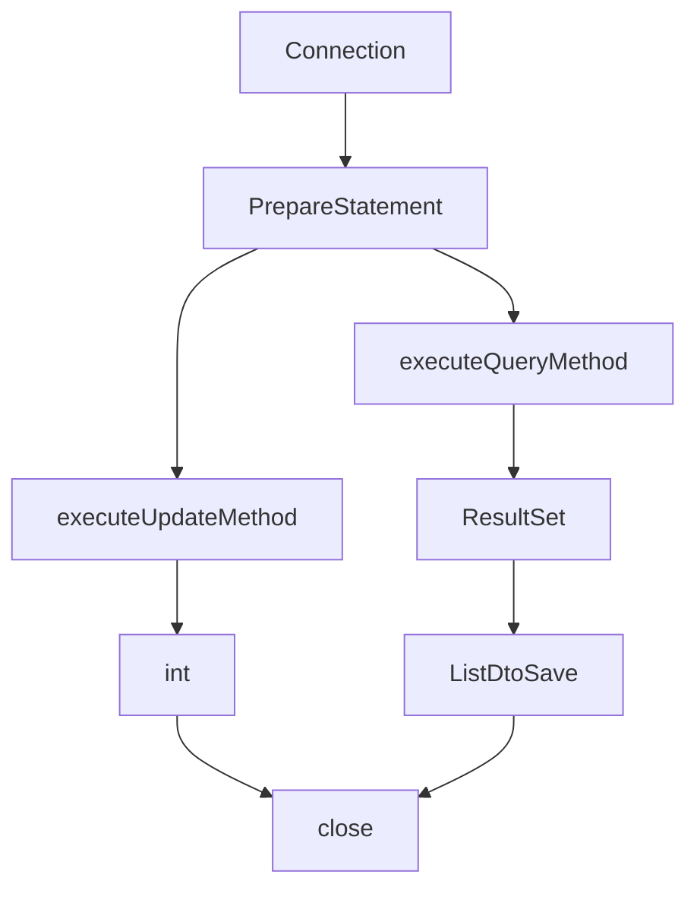

## JDBC Util
###  개요
-  DBUtil 은 자바에서 제공하는 JDBC 의 반복적인 요소를 줄이고, 손쉽게 DB 를 이용할수 있게끔 만들어 놓은 커스터마이징 JDBC 이다.
- 이 기능은 Java 에서 제공하는 JDBC 보단, Spring JDBC 에서의 JdbcTemplate 의 기능과 유사한 점이 있다
- 위 코드를 작성하기 위해서는 reflection, generic, interface 등의 Java API 를 학습해야 했다.


##  파일트리
- connect
	- DBConnection : Jdbc 연결과 관련된 Connection, PrepareStatement 를 구현했다
- source
	- DBInfo :  DB class, Url, id, pw 를 저장한다.
	- DBSql.java : 쿼리를 저장한다.
- use
	- DBUtil.java :  쿼리 파라미터 주입, reflection을 활용한 DTO 인스턴스 생성등  JDBCUtil 에 필요한 필수 기능들이 포함되어 있다.
	- UseDB.java : select, insert, update 등의 기능을 구현한 인터페이스이다.
	- UseDBImpl.java : UseDB 의 구현체이다.

## JDBC 프로세스 

- 왼쪽 - insert, update, delete / 오른쪽 - select
- 위 프로세스에서 각 쿼리구문들은 Connection, PrepareStatement, close 라는 공통적인 부분이 존재하기 때문에 별도로 분리하여 구조화 시킬수 있다.

## 공통 프로세스 분리 - Connection, PrepareStatement, close
- 위 프로세스에서 Connection 과 PrepareStatement는 DB 를 사용하기 위해서 무조건 사용해야 하는 객체이기 때문에 **DBConnection** 에서 별도로 정의해 놓았다.

### Connection, PrepareSateMent
- Connection 에 필요한 은 DB address,  ID, PW 를 필요로하는데 이 정보는 DBInfo에서 static 필드로 저장하여 사용했다.
```java
public class DBInfo {  
    public static String DB_ADDR_MYSQL ="jdbc:mysql://localhost:3306/todo";  
    public static String DB_USER ="boostuser";  
    public static String DB_PW  = "12345678";
}
```
- Connection 인스턴스는 DBConnection 의 setParamSql(String sql) 메서드를 통해 생성이 가능하다.
- PrepareStatement 는 Connection 의 prepareStatement(sql) 로 생성이 가능하다.
```java
public PreparedStatement setParamSql(String sql){  
    try{  
        this.conn = DriverManager.getConnection(DB_ADDR_MYSQL, DB_USER, DB_PW);  
        this.psmt = conn.prepareStatement(sql);  
        return psmt;  
    }catch (Exception e){  
        e.printStackTrace();  
        throw new IllegalArgumentException("DB 접속에 문제가 있음");  
    }  
}
```
### Close
- Select 문에서는 Connection, PrepareStatement, ResultSet, 나머지 쿼리문에서는 Connection, PrepareStatement 순으로 close 메소드가 실행되어야 한다.
```java
public void  closedConnection(Connection conns, PreparedStatement psmts, ResultSet rs) throws SQLException {  
    if(conns!=null){  
        conns.close();  
    }  
    if(psmts!=null){  
        psmts.close();  
    }  
    if(rs != null){  
        rs.close();  
    }  
}
```
- Select 를 제외한 나머지 쿼리문에서 close 메소드를 실행하기 위해서는 아래와 같이 ResultSet 매개변수에 null을 입력해주면 된다.
```java
closedConnection(connection, preparestatement, resultset) //select 문
closedConnection(connection, preparestatement, null) // 나머지 쿼리문
```


## SQL Mapping
- PrepareStatement 에서 sql 쿼리문을 실행할수 있다. 이때 쿼리문은 입력되는 값으로 동적으로 생성이 가능해야 하는데 기존 JDBC 에서는 아래와 같이 활용이 되고 있다.
```java
String insertSql = "insert into todo (username, description, priority) values (?, ?, 1 );
psmt = conn.prepareStatement(sql);
psmt.setString(1, "testName");
psmt.setString(2, "testDescription");
psmt.setInt(3, 1);

```
- DBUtil 에서는 JdbcTemplate 과 유사하게,Map을 활용하여 파라미터를 동적으로 입력할 수 있게 하였다.
- Map 의 key - value 는 sql 문의 parameter - value 값과 대응되며, 아래와 같이 사용이 가능하다. 
```java
String insertSql = "insert into todo (username, description, priority) values( :username , :description , :priority )";

Map<String, String> param = new HashMap();
params.put("username", "testName");  
testName.put("description", "testDescription");  
params.put("priority", "1");

UseDB useDB = new UseDBImpl();
int resultCount = useDB.insert(insetSql, param);
```
- 또한 입력 파라미터가 int 일때는 none-quotation , String  일때는 single-quotation 을 붙여주어 동적인 sql 문을 만들 수 있다.
```java
private String paramInputSql(Map<String, String> sqlParam, String sql) {  
    String tempSql = sql;  
  
    for(Map.Entry entry: sqlParam.entrySet()){  
        String key = entry.getKey().toString();  
        String value =typeValue(entry.getValue().toString());  
        tempSql = tempSql.replace(":"+key, value);  
    }  
    return tempSql;  
}  

// 입력된 value 값이 숫자인지 확인 후 숫자가 아니라면 single-quotation 을 입력해준다.
private String typeValue(String obj){  
    String temp = obj;  
    char check;  
    if(temp.equals("")){  
        return "";  
    }  
  
    for(int i=0; i <temp.length();i++) {  
        check = temp.charAt(i);  
        if (check < 48 || check > 58) {  
            return "'" + temp + "'";  
        }  
    }  
    return t
```


## Java Replection 을  Dto 활용
- 자바 리플렉션은 자바 런타임 시점에서 클래스의 필드, 메소드등의 접근을 도와주는 자바 API 중 하나로서, 다양한 라이브러리에 사용되고 있다. 
- 해당 Replection은 다음의 로직으로 활용되고 있다
> 1. select 쿼리문을 실행하여 ResultSet 의 결과를 가져온다. 
```java
String sql = "select id, username, description, stage, priority, regdate from todo";
ResultSet resultSet = dbconn.setParam(sql).executeQuery();
```
> 2. select 결과에서의 칼럼명 or alias 로 도출되는 결과가 리플렉션을 통해 가져오는 클래스의 필드명과 두 일치하여야 한다. 그리고 DTO 에서 Setter 메소드는 필수이다. 
```java
@Getter
@Setter
public class TodoDto {  
   public long id;   // select 구문 id 일치
   public String username;  // select 구문 username 일치
   public String description;  // select 구문 description 일치
   public int stage;  // select 구문 stage 일치
   public int priority;  // select 구문 priority 일치
   public Date regDate;  // select 구문 regdate 일치
}

public static void main(String[] args) {  
    Class dto = TodoDto.class;
    List<TodoDto> lists = new ArrayList<>();

	Field[] fields = dto.getFields();
	Map<String, Object> tempMap = new LinkedHashMap<>(); // 순서가 보장되는 맵

	for(Field f : fields){  //클래스에 선언된 모든 필드명과 타입을 모두 가져와서 맵에 순서대로 저장함.
	   String fieldName = f.getName();  
	   Class<?> type = f.getType();  
	   tempMap.put(fieldName, type);  
	}
}
```
> 3. 맵에 저장된 필드변수명과 타입을 이용하여, 클래스 생성자로 인스턴스를 만들고 Setter 메소드를 활용하여 값이 저장된 Dto를 만들어 리스트에 저장하는데, 쉽게 코드로 풀어쓰자면 아래의 과정을 동적으로 만드는 것이다.
```java
//정적인 dto list
TodoDto dto = new TodoDto();
dto.setId(rs.getInt("id"));
dto.setUsername(rs.getString("username"));
.
.
.
lists.add(dto);

//동적인 dto list
for(rs.next()){
Class tempClass = TodoDto.class;


}

```

